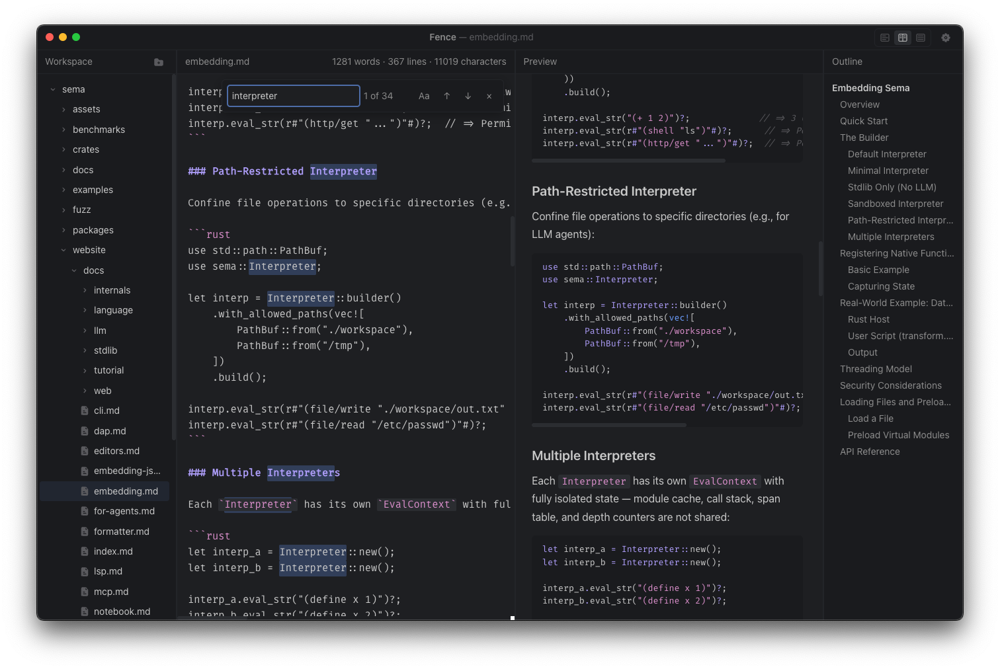

<p align="center">
  

</p>

<h1 align="center">Fence</h1>

<p align="center">
  A split-view markdown editor built with Elm and Electron.
</p>

<p align="center">
  
  
  
  
  
</p>

---

Fence provides a clean, focused environment for writing markdown with a live preview, frontmatter support, syntax highlighting, and mermaid diagram rendering.

## Features

- **Split-View Editor** — Real-time markdown preview as you type
- **Frontmatter Support** — Parses and displays YAML frontmatter
- **Syntax Highlighting** — Built-in support for Elm, JavaScript, Python, CSS, JSON, and more
- **Mermaid Diagrams** — Render mermaid diagrams directly in the preview
- **File Explorer** — Integrated file tree for managing your markdown files
- **Themes** — Customizable themes for the editor environment
- **Auto-Update** — Built-in auto-updater via GitHub releases
- **Cross-Platform** — Builds for macOS, Windows, and Linux

## Getting Started

### Prerequisites

- [Bun](https://bun.sh/)

### Installation

```bash
git clone https://github.com/helgesverre/fence.git
cd fence
bun install
```

### Development

Start the development server with hot-reloading:

```bash
bun run dev
```

With Electron DevTools enabled:

```bash
bun run dev:debug
```

### Building

Build for your platform:

```bash
# Generic build
bun run build

# Platform-specific
bun run build:mac
bun run build:win
bun run build:linux
```

## Project Structure

```
src/
├── Main.elm            Application entry point
├── Editor.elm          Markdown editor component
├── Markdown.elm        Markdown parsing and rendering
├── Preview.elm         Preview pane rendering
├── FileTree.elm        File navigation component
├── Frontmatter.elm     YAML frontmatter parsing
├── Yaml.elm            YAML parser
├── Ports.elm           Elm port definitions
├── Types.elm           Shared types
└── Icon.elm            SVG icon components
electron/
├── main.js             Electron main process
├── preload.js          Preload script (context bridge)
└── fs-ops.js           File system operations
js/
├── main.js             App initialization
├── elm.js              Elm app bootstrap
├── ports.js            Port subscriptions
├── editor-keys.js      Keyboard shortcut handling
└── mermaid-init.js     Mermaid diagram rendering
static/
├── fonts/              Bundled fonts
└── styles/             CSS stylesheets
tests/
└── YamlTest.elm        YAML parser tests
```

## Tech Stack

| Layer    | Technology                                    |
| -------- | --------------------------------------------- |
| Frontend | [Elm](https://elm-lang.org/)                  |
| Desktop  | [Electron](https://www.electronjs.org/)       |
| Build    | [Vite](https://vitejs.dev/) + vite-plugin-elm |
| Diagrams | [Mermaid](https://mermaid.js.org/)            |
| Testing  | elm-test                                      |

## License

MIT
