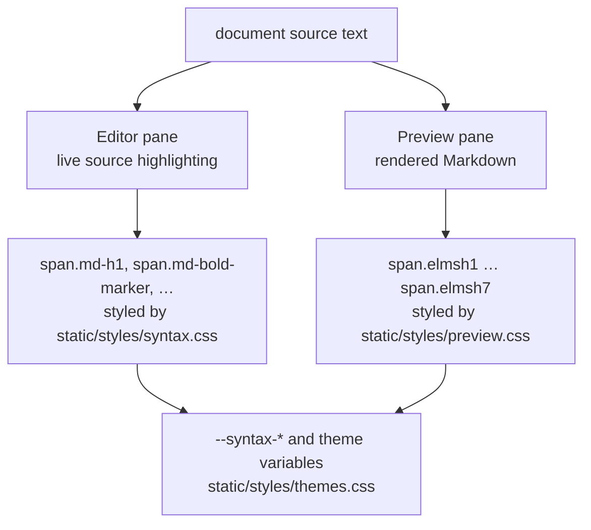
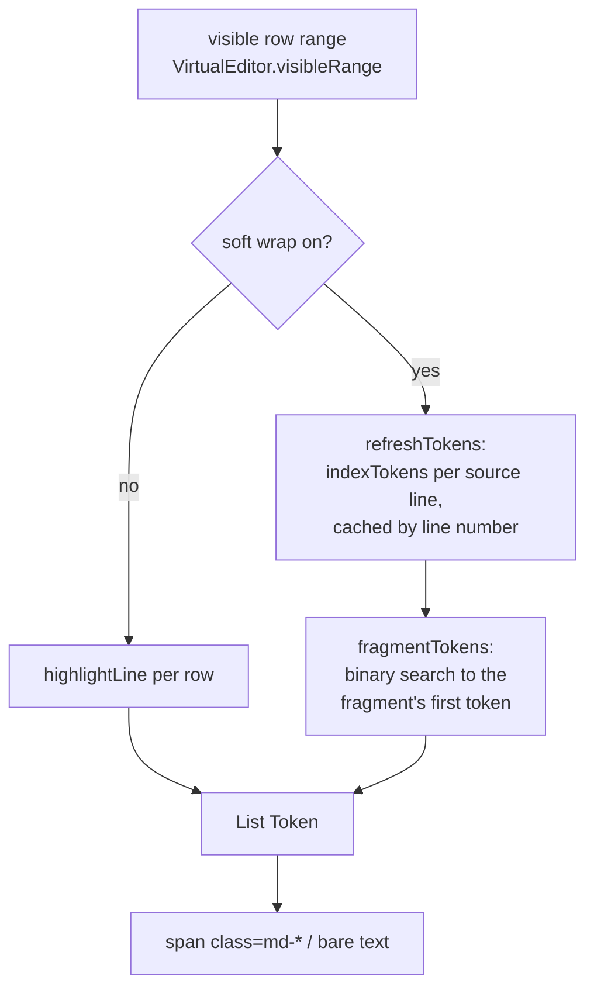
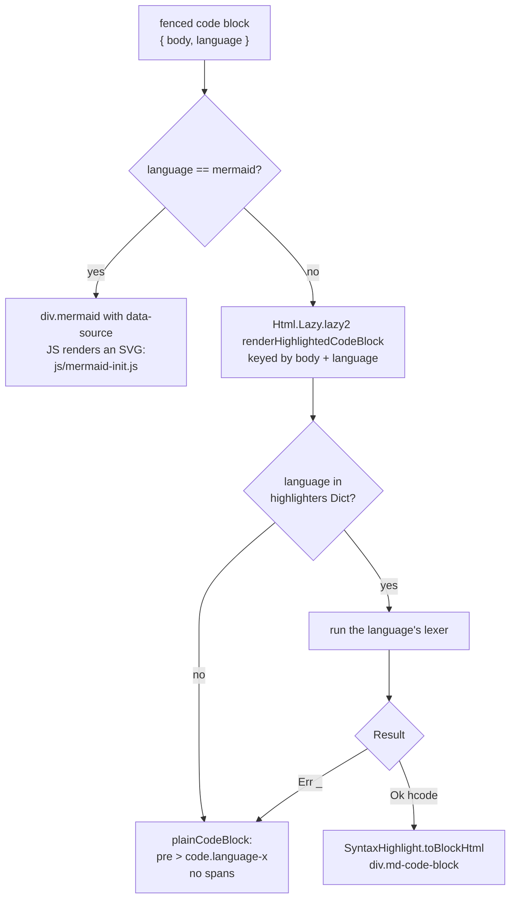
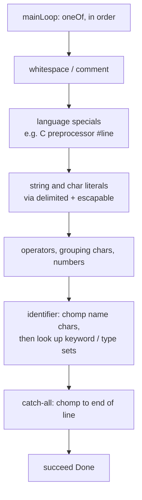

# Rendering and syntax highlighting

How text gets from a `.md` file on disk to colored pixels in Fence's two
panes. Open this file in Fence to read it: the diagrams below are Mermaid,
which the preview renders natively.

## Two independent systems

Fence highlights text twice, in two completely separate pipelines that share
no code, no token types and no CSS classes:

| | Editor pane | Preview pane |
|---|---|---|
| What it colors | Markdown *syntax* in the raw source | *Rendered output*, including code inside fences |
| Parser | Hand-rolled per-line classifier | `dillonkearns/elm-markdown`, plus a per-language lexer |
| Granularity | One visible row at a time | Whole document, chunked by top-level heading |
| CSS classes | `md-h1`, `md-bold-marker`, … (~15 named) | `elmsh1`…`elmsh7`, `elmsh-comm` (7 generic buckets) |
| Owner | `src/Editor.elm` | `src/Markdown.elm` + `src/syntax/` |

The editor deliberately knows nothing about the languages inside fenced code
blocks. It marks the fence line itself and leaves the contents plain, so
typing stays cheap no matter what the block contains.



---

## Editor pane: live source highlighting

`src/Editor.elm` (see the `SYNTAX HIGHLIGHTING` section near the end) holds a
small classifier. It is not a parser; it is a sequence of prefix and inline
checks over a single line of text.

`lineTokens : String -> List Token` returns runs of
`{ class : Maybe String, text : String }` whose concatenation reproduces the
line exactly. Block-level rules test the trimmed line prefix and claim the
whole line (`# ` → `md-h1`, ```` ``` ```` → `md-code-fence`, `> ` →
`md-blockquote-marker`, thematic breaks → `md-hr`, list markers →
`md-list-marker`). Inline rules then scan the remainder for `**bold**`,
`*italic*`, `` `code` `` and links, emitting `md-bold-marker`,
`md-italic-marker`, `md-code-span` and `md-link`.

Only rows that are actually on screen are ever tokenized, because the editor
is virtualized (`src/VirtualEditor.elm` renders visible rows plus a small
overscan). Two layers of caching sit on top:

- **`Html.Lazy`** per row. Elm compares the row's source string by value, so
  an unchanged row skips both the classifier and the virtual-DOM diff.
- **`tokenCache`**, used when soft wrap is on. A wrapped source line becomes
  several visual fragments; `indexTokens` tokenizes the line once and records
  each token's start/end offset, and `fragmentTokens` binary-searches that
  array to find where a given fragment starts. Without it, a long wrapped
  paragraph would re-tokenize the entire line once per visual row.



### The cell grid

Everything the editor positions — the caret, selection rectangles,
find-match highlights, soft-wrap break points, the horizontal scroll extent —
is computed as `cellCount * charWidth`, where `charWidth` is one measured
monospace advance. So the editor needs to agree with the font about how many
advances a string occupies.

One code point is not one advance, so `TextBuffer.advance` implements a
`wcwidth`-style model, the same approach terminals use:

| Width | Applies to |
|---|---|
| 0 cells | combining marks (Mn/Me ranges), zero-width space/joiner/non-joiner, word joiner, variation selectors |
| 0 cells | a code point directly after a ZWJ, and the second of a regional-indicator pair, so an emoji cluster counts once |
| 2 cells | East Asian Wide and Fullwidth ranges, and the emoji planes |
| 1 cell | everything else |
| to next tab stop | tab |

Every call site routes through it: `TextBuffer.visualColumn` and its inverse
`columnFromVisual`, `EditorLayout.cellAfter`/`positionAt`/`wrapCharacters`/
`expandTabs`, and `VirtualEditor`'s selection-rect counting. The two
directions must stay consistent or clicking lands the caret in the wrong
place.

Known limits. CJK and full-width glyphs still drift about 3px each, because
the fallback font draws them at roughly 1.64 times the ASCII advance rather
than exactly 2; closing that needs a font that is genuinely dual-width, not a
model change. Rows keep `overflow: hidden`, so a tall stack of combining
marks is clipped to its line: letting it paint freely makes the neighbouring
lines unreadable, which is worse.

---

## Preview pane: rendered Markdown and code blocks

### Stage 1, progressive Markdown parse

`src/Markdown.elm` splits the document at top-level headings
(`splitChunks`) and parses chunk by chunk, so a large file paints its first
screen without blocking.

- `Markdown.begin` starts a parse and returns a `Progress` value.
- `Markdown.step` consumes chunks until a character budget is spent:
  `firstParseBudget` is 15,000 characters (before first paint),
  `parseStepBudget` is 60,000 for each follow-up step.
- `src/Main.elm` continues stepping in `Frame` messages, one step every other
  animation frame, until `Markdown.isComplete`.
- A per-chunk `Cache` keyed by the chunk's exact source text holds both parsed
  blocks and the rendered `Html`. An unchanged chunk costs nothing and keeps
  the *identical* `Html` value, which lets `Html.Lazy` skip it downstream.
- Edits are debounced by document size before a re-parse starts:
  50 ms normally, 150 ms over 250 KB, 400 ms over 1 MB (`previewDelay`).
- A generation counter discards results from a parse the user has typed past.

### Stage 2, dispatch a fenced code block

`renderCodeBlock` sees each fence's info string and branches:



Mermaid is intercepted *before* highlighting and never reaches the
highlighter. Elm owns only the `data-source` attribute on that element; the
rendered SVG children belong to JS, which keeps Elm from diffing SVG it did
not create.

The dispatch table is one `Dict` in `src/Markdown.elm`:

```elm
highlighters : Dict String Highlighter
highlighters =
    [ ( [ "elm" ], SyntaxHighlight.elm )
    , ( [ "javascript", "js", "jsx", "mdx" ], SyntaxHighlight.javascript )
    -- …26 entries, 65 aliases total
    ]
        |> List.concatMap (\( names, fn ) -> List.map (\name -> ( name, fn )) names)
        |> Dict.fromList
```

Twenty-six highlighter functions cover 65 fence aliases. One alias is still a
lexically-close stand-in rather than real support: `groovy` runs on the Kotlin
lexer, which gets strings, comments, numbers and brackets right but misses
most keywords. Anything absent from the table (Lua, Haskell, R, Perl,
PowerShell, Zig, Objective-C, …) renders as unstyled text.

Some lexers serve more than one language through a dialect parameter that
only swaps the keyword and type sets: `C.elm` covers C and C++, and
`CurlyBrace.elm` covers Java, C#, Swift and Scala.

### Stage 3, the lexer

`src/syntax/` is a vendored fork of `pablohirafuji/elm-syntax-highlight`.
Every language is a self-contained `elm/parser` lexer under
`SyntaxHighlight/Language/`; there is no shared grammar and no inheritance
(`TypeScript.elm` does not reuse `Javascript.elm`). `Helpers.elm` provides the
common primitives: `delimited` for anything with a start and end token,
`escapable` for backslash escapes, `number`, whitespace predicates.

A lexer is a `Parser.loop` over a `oneOf` of branches, ordered by priority,
each producing tokens onto a reversed accumulator:



Each module declares its own `Syntax` type with whatever categories that
language needs (`C.elm` uses `Number`, `String`, `Keyword`, `Type`,
`LiteralKeyword`, `Preprocessor`, `Operator`).

### Stage 4, collapse to seven buckets

Every language's private `Syntax` type is mapped by its own `syntaxToStyle`
onto one shared, fixed palette — this is the entire color vocabulary in the
system:

| Bucket | Conventional use | CSS class |
|---|---|---|
| `Default` | plain text | `elmsh` |
| `Comment` | comments | `elmsh-comm` |
| `Style1` | numbers | `elmsh1` |
| `Style2` | strings, attribute values | `elmsh2` |
| `Style3` | keywords, operators | `elmsh3` |
| `Style4` | types, group symbols | `elmsh4` |
| `Style5` | functions, attribute names | `elmsh5` |
| `Style6` | literal keywords (`true`, `NULL`) | `elmsh6` |
| `Style7` | parameters, arguments | `elmsh7` |

`syntaxToStyle` also returns a language-specific class name (`"c-k"`,
`"go-n"`), which `View.elm` emits as `elmsh-c-k`. **Fence styles none of
these**, so they are inert; adding a language needs no CSS work. They exist
for consumers who want per-language overrides.

`Line.elm` turns the token stream into `List Line`, where each `Line` holds
`List Fragment` and each `Fragment` is `{ text, requiredStyle,
additionalClass }`. Adjacent fragments that land in the same bucket are
merged into one span. That merging is worth knowing when writing tests: in
`typedef struct { uint32_t len; } Row;` the trailing ` len; } Row;` arrives
as a *single* default-styled fragment, not one per identifier.

### Stage 5, CSS

`View.elm` renders `pre.elmsh` containing one element per line and one span
per fragment. `static/styles/preview.css` maps the seven buckets to theme
variables, and `static/styles/syntax.css` does the same for the editor's
`md-*` classes. Colors ultimately resolve through
`static/styles/themes.css`, which defines `--syntax-heading`,
`--syntax-strong`, `--syntax-emphasis`, `--syntax-code` and `--syntax-list`
per theme (eight `data-theme` blocks plus the `:root` default), all in oklch.

The library ships its own `Theme` module with Monokai, GitHub and OneDark
palettes that inject a `<style>` block. Fence does not use it — styling the
classes directly from the app's own theme variables is what keeps code blocks
consistent with the rest of the UI across all themes.

---

## Adding a language

1. Write `src/syntax/SyntaxHighlight/Language/<Name>.elm`. Copy the
   closest existing module as a skeleton: `Go.elm` for a C-family language,
   `Python.elm` for an indentation-sensitive one. Define a `Syntax` type, a
   `mainLoop`, and `syntaxToStyle`.
2. Import it in `src/syntax/SyntaxHighlight.elm` and expose a
   one-line wrapper (`Name.toLines >> Result.map HCode`).
3. Add fence aliases to the `highlighters` table in `src/Markdown.elm`.
4. Add the language to the shared list in `tests/SyntaxHighlightTest.elm`. It
   is automatically covered by the round-trip test (output text must equal
   input exactly) and the edge-case test (empty input, unterminated strings
   and comments, tabs, unicode, very long lines). Add a classification test
   for a few keywords.

No CSS changes are required.

If one lexer serves two dialects, parameterize it rather than duplicating:
`C.elm` takes a `Dialect` of `C` or `Cpp` that only selects which keyword and
type sets apply, and `SyntaxHighlight.elm` exposes `c` and `cpp` as two
partial applications.

## Known gaps

- **No shell, YAML, Ruby or C# lexer.** These fall through to unstyled text,
  and shell in particular is very common in documentation.
- **Java, Scala, Swift, Groovy** run on the Kotlin lexer; structure is right,
  keywords largely are not.
- **C++ raw string literals** (`R"(...)"`) are not recognized.
- **Preprocessor directives** are one flat span from `#` to end of line; macro
  bodies are not tokenized, and a trailing backslash continuation is not
  followed.
- **User-defined type names are not highlighted.** No lexer does semantic
  analysis, so only built-in type names are colored. `C.elm` additionally
  treats any identifier ending in `_t` as a type, which covers the usual C
  convention.
- **`js/elm.js`** is a stale 860 KB build artifact from before
  `vite-plugin-elm` compiled `src/Main.elm` directly. Nothing imports it. It
  is still committed and is safe to delete.

## Wide tables

A table wider than the preview pane used to be clipped: the pane's
`overflow-x` is `hidden`, so the right-hand columns simply became
unreachable. `Markdown.scrollableTable` now wraps every table, from GFM
syntax and from raw HTML alike, in its own horizontal scroll container.

- The table is `width: max-content` with `min-width: calc(100% - 1px)`, so it
  fills the pane when narrow and sizes to its content when wide rather than
  squeezing 40 columns into the available space.
- The wrapper carries `role="region"`, an accessible name and `tabindex="0"`.
  A scroll container that answers only to the wheel leaves keyboard-only
  readers unable to reach the columns at all.
- `overscroll-behavior-x: contain` stops a scroll that reaches the end of the
  table from continuing into the pane.
- Edge shadows come from `@container scroll-state(scrollable: left|right)`, so
  each side's shadow appears only while there is more table behind it. Scroll
  state queries are Chromium-only, which is fine here: Fence ships its own
  Chromium. Without support the shadows never appear and scrolling is
  unaffected.

Sticky headers are deliberately absent. Giving the wrapper `overflow-x` makes
it the scroll container on both axes, which breaks `position: sticky` against
the pane, so a sticky header row would need the pane itself to be the
scroller.
