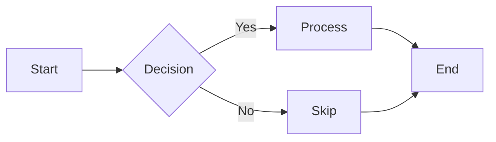

# GFM Kitchen Sink

This file is Fence's manual-QA document for Markdown rendering. It tries to exercise
every construct of GitHub Flavored Markdown that the preview pane is expected to
handle, plus a few deliberate edge cases and one section of content that *must not*
render (the sanitization check).

Open it in Fence and scan section by section. Each section says what it is testing, so
a wrong result should be obvious without diffing against another renderer. Sections
marked **edge case** are places where renderers legitimately disagree — note the
behaviour, do not assume a bug.

## Table of Contents

1. [Headings](#headings)
2. [Paragraphs and Line Breaks](#paragraphs-and-line-breaks)
3. [Horizontal Rules](#horizontal-rules)
4. [Emphasis](#emphasis)
5. [Escapes](#escapes)
6. [Inline Code](#inline-code)
7. [Links](#links)
8. [Images](#images)
9. [Lists](#lists)
10. [Task Lists](#task-lists)
11. [Blockquotes](#blockquotes)
12. [Code Blocks](#code-blocks)
13. [Syntax Highlighting Gallery](#syntax-highlighting-gallery)
14. [Mermaid](#mermaid)
15. [Tables](#tables)
16. [Footnotes](#footnotes)
17. [Definition Lists](#definition-lists)
18. [Inline HTML](#inline-html)
19. [Sanitization Check](#sanitization-check)
20. [Entities and Unicode](#entities-and-unicode)
21. [Long Content](#long-content)

---

## Headings

All six ATX levels, then the two Setext forms.

# Heading 1

## Heading 2

### Heading 3

#### Heading 4

##### Heading 5

###### Heading 6

Setext Heading 1
================

Setext Heading 2
----------------

`####### Seven hashes` is not a heading — this line should stay a paragraph:

####### Seven hashes are one too many

Closed ATX form (trailing hashes are decoration, not text):

### Closed heading ###

## Paragraphs and Line Breaks

This is a plain paragraph. Blank lines separate paragraphs; a single newline inside a
paragraph is a soft wrap, so this sentence
and this one
should end up on the same rendered line when the pane is wide enough.

This paragraph ends with two trailing spaces,  
so the break above is hard and this text starts a new line.

This paragraph ends with a backslash,\
so this break is hard too, via the other syntax.

Trailing whitespace that is only *one* space does not break, 
and this continues the same line.

## Horizontal Rules

Three syntaxes, all of which should produce an identical rule:

---

***

___

Spaced and repeated markers are also valid rules:

- - -

****************

## Emphasis

Basic forms: **bold text**, *italic text*, ***bold italic***, and ~~strikethrough~~.

Underscore variants: __bold with underscores__, _italic with underscores_, and
___bold italic with underscores___.

Nesting:

- **Bold containing *nested italic* inside**
- *Italic containing **nested bold** inside*
- ~~Strikethrough containing **bold** inside~~
- **Bold containing `code` inside**
- *Italic containing [a link](https://example.com) inside*
- ~~**Everything** at *once*~~

Intraword emphasis — **edge case**. Asterisks work inside a word, underscores do not:

- Intra*word*emphasis with asterisks renders as emphasis.
- Intra_word_emphasis with underscores stays literal.
- snake_case_identifier should keep both underscores.
- 2*3*4 should stay literal arithmetic, not emphasis.

Unmatched and awkward delimiters — **edge case**:

- A lone * asterisk surrounded by spaces is literal.
- **Unclosed bold marker at the end of this line.
- ****Four asterisks**** wrapping text.
- `a ** b ** c` inside code is untouched.

Strikethrough with a single tilde: ~single tilde~ (GFM accepts one or two).

## Escapes

Every ASCII punctuation mark can be backslash-escaped:

\\ \` \* \_ \{ \} \[ \] \( \) \# \+ \- \. \! \| \< \> \~ \&

Escaped constructs that should therefore render as literal text:

- \*not italic\* and \*\*not bold\*\*
- \# not a heading
- \[not a link\](https://example.com)
- \`not code\`
- A table pipe escaped inline: a \| b

A backslash before a non-punctuation character is literal: \A \9 \ (backslash, space).

## Inline Code

Use `const x = 42;` for a simple code span.

A span containing backticks needs a longer fence: `` `backtick` `` and
``` `` double `` ``` both work.

A code span containing HTML-looking text must not become HTML:
`<script>alert("no")</script>` and `<div class="x">` and `<br>`.

A code span containing markdown syntax stays literal: `**not bold** [not a link](x)`.

Leading and trailing spaces inside a span are stripped: `` ` `` renders one backtick.

Long spans should not wrap mid-token: `supercalifragilisticexpialidocious_but_in_code_form`.

## Links

Inline forms:

- [Inline link](https://example.com)
- [Link with title](https://example.com "Example Site")
- [Link with a *formatted* **text** and `code`](https://example.com)
- [Link with parentheses in URL](https://en.wikipedia.org/wiki/Markdown_(disambiguation))
- [Empty link target]()

Reference forms — the definitions live at the end of this section:

- [Full reference link][ref-full]
- [Collapsed reference link][]
- [Shortcut reference link]
- [Case-Insensitive Reference][REF-FULL]

Autolinks:

- Bare URL, GFM autolink literal: https://example.com/path?query=1&other=2
- Bracketed autolink: <https://example.com>
- Bare www autolink: www.example.com
- Email autolink: user@example.com
- Bracketed email autolink: <user@example.com>

Relative and in-document links:

- [Relative link to a sibling sample](./mermaid.md)
- [Relative link up a directory](../README.md)
- [Anchor link to the Tables section](#tables)
- [Anchor link back to the top](#gfm-kitchen-sink)

A URL that is not autolinked because it is inside code: `https://example.com`.

[ref-full]: https://example.com "Full Reference Definition"
[collapsed reference link]: https://example.com/collapsed
[shortcut reference link]: https://example.com/shortcut

## Images

Inline image:


Image with a title attribute:


Reference-style image:

![Reference image][img-ref]

Image wrapped in a link (click target should be the link, not the image):

[](https://example.com)

Deliberately broken path — only the alt text should survive:


Inline image in a sentence: an icon  mid-paragraph.

[img-ref]: https://picsum.photos/600/300 "Reference-defined image"

## Lists

### Bullet Markers

All three markers are valid. Changing the marker starts a *new* list — **edge case**:

- Dash item one
- Dash item two

* Asterisk item one
* Asterisk item two

+ Plus item one
+ Plus item two

### Ordered Lists

Period delimiter:

1. First item
2. Second item
3. Third item

Parenthesis delimiter:

1) First item
2) Second item
3) Third item

Non-1 start value (the list should begin at 42):

42. Forty-two
43. Forty-three
44. Forty-four

Numbers other than the first are ignored — this should render 1, 2, 3:

1. One
1. Two
1. Three

### Nesting

- Level one
  - Level two
    - Level three
      - Level four
        - Level five
- Level one again

1. Ordered level one
   - Unordered level two
     1. Ordered level three
        - Unordered level four
2. Ordered level one again

### Tight vs Loose

A tight list (no blank lines, no `<p>` wrappers):

- Tight one
- Tight two
- Tight three

A loose list (blank lines between items, each item wrapped in a paragraph):

- Loose one

- Loose two

- Loose three

### Lists Containing Blocks

1. An item with two paragraphs.

   This is the second paragraph of the first item, indented three spaces to stay
   inside the list.

2. An item with a fenced code block:

   ```elm
   greet : String -> String
   greet name =
       "Hello, " ++ name ++ "!"
   ```

3. An item with a blockquote:

   > Quoted text inside a list item.
   > It continues on a second line.

4. An item with a nested table:

   | Key | Value |
   | --- | ----- |
   | a   | 1     |
   | b   | 2     |

5. An item with a horizontal rule:

   ---

   And content after the rule.

## Task Lists

- [x] Completed task
- [x] Another done task
- [ ] Incomplete task
- [ ] Task with **formatting** and `code` and a [link](https://example.com)
- [ ] Parent task with nested children
  - [x] Nested completed subtask
  - [ ] Nested incomplete subtask
    - [x] Third-level completed subtask
- [X] Uppercase X should also count as checked

Ordered task list:

1. [x] First step done
2. [ ] Second step pending

Not a task list — **edge case**. These should render as literal brackets:

- [x]No space after the bracket
- Text before the [ ] checkbox

## Blockquotes

> A single-level blockquote with **formatted text**.
>
> It can contain multiple paragraphs.

Nesting:

> Level one.
>
> > Level two.
> >
> > > Level three.

Blockquotes containing other block elements:

> ### A heading inside a quote
>
> - A list inside a quote
> - Second item
>
> ```javascript
> console.log("a code block inside a quote");
> ```
>
> | Inside | A Quote |
> | ------ | ------- |
> | yes    | yes     |
>
> ---
>
> A rule inside a quote, and a final paragraph.

Lazy continuation — only the first line carries the `>` marker, but the whole
paragraph should still be quoted:

> This line starts the quote
and this line is lazily continued
and so is this one.

Attribution style:

> **Note:** Blockquotes are good for callouts and citations.
>
> — *Someone Famous*

An empty blockquote line:

>
> Content after an empty quote line.

## Code Blocks

### Indented

    This is an indented code block.
    It uses four spaces of indentation.
    No syntax highlighting is applied.
        Deeper indentation is preserved verbatim.

### Fenced with Backticks, No Language

```
Plain fenced block without an info string.
  Leading whitespace is preserved.
Symbols like <div> and **bold** stay literal.
```

### Fenced with Tildes

~~~
A tilde-fenced block. Tildes let the body contain ``` backtick fences
without terminating the block early.
~~~

### Fenced with an Unknown Language

```notalanguage
This info string matches no highlighter.
It should render as plain preformatted text, not as an error.
```

### Fence Containing a Fence

Four backticks can wrap three:

````markdown
```python
print("a fenced block inside a fenced block")
```
````

### Empty Fence

```
```

## Syntax Highlighting Gallery

One block per language Fence highlights.

```elm
module Greeting exposing (greet)

{-| Greet someone by name. -}
greet : String -> String
greet name =
    case String.trim name of
        "" ->
            "Hello, stranger!"

        trimmed ->
            "Hello, " ++ trimmed ++ "!"
```

```javascript
function fibonacci(n) {
  if (n <= 1) return n;
  return fibonacci(n - 1) + fibonacci(n - 2);
}

const result = fibonacci(10);
console.log(`Fibonacci(10) = ${result}`);
```

```typescript
interface User {
  id: number;
  name: string;
  email?: string;
}

export async function fetchUser(id: number): Promise<User> {
  const response = await fetch(`/api/users/${id}`);
  if (!response.ok) throw new Error(`HTTP ${response.status}`);
  return response.json() as Promise<User>;
}
```

```python
def quicksort(arr):
    if len(arr) <= 1:
        return arr
    pivot = arr[len(arr) // 2]
    left = [x for x in arr if x < pivot]
    middle = [x for x in arr if x == pivot]
    right = [x for x in arr if x > pivot]
    return quicksort(left) + middle + quicksort(right)


print(quicksort([3, 6, 8, 10, 1, 2, 1]))
```

```json
{
  "name": "fence",
  "version": "1.0.0",
  "private": true,
  "dependencies": {
    "electron": "^44.0.0",
    "vite": "^8.0.0"
  },
  "enabled": true,
  "retries": null
}
```

```css
.container {
  display: grid;
  grid-template-columns: repeat(auto-fit, minmax(250px, 1fr));
  gap: 1rem;
  padding: 2rem;
  color: oklch(0.72 0.11 258);
}

@media (prefers-color-scheme: dark) {
  .container { background: #11111b; }
}
```

```sql
SELECT u.id, u.name, COUNT(o.id) AS order_count
FROM users AS u
LEFT JOIN orders AS o ON o.user_id = u.id
WHERE u.created_at >= '2026-01-01'
GROUP BY u.id, u.name
HAVING COUNT(o.id) > 3
ORDER BY order_count DESC
LIMIT 10;
```

```html
<!doctype html>
<html lang="en">
  <head>
    <meta charset="utf-8" />
    <title>Fence</title>
  </head>
  <body>
    <main id="app" class="shell"><!-- mounted by Elm --></main>
  </body>
</html>
```

```go
package main

import "fmt"

type Point struct {
	X, Y int
}

func main() {
	points := []Point{{1, 2}, {3, 4}}
	for i, p := range points {
		fmt.Printf("%d: (%d, %d)\n", i, p.X, p.Y)
	}
}
```

```rust
fn main() {
    let names = vec!["Alice", "Bob", "Charlie"];
    for (i, name) in names.iter().enumerate() {
        println!("{i}: Hello, {name}!");
    }
}
```

```c
#include <stdio.h>

int main(void) {
    for (int i = 0; i < 5; i++) {
        printf("i = %d\n", i);
    }
    return 0;
}
```

```cpp
#include <iostream>
#include <vector>

int main() {
    std::vector<int> values{1, 2, 3, 4};
    for (const auto &v : values) {
        std::cout << v * v << '\n';
    }
}
```

```php
<?php

declare(strict_types=1);

function slugify(string $title): string
{
    return trim(preg_replace('/[^a-z0-9]+/', '-', strtolower($title)), '-');
}

echo slugify('Hello, GFM World!');
```

```dart
void main() {
  final numbers = <int>[1, 2, 3, 4];
  final squares = numbers.map((n) => n * n).toList();
  print('Squares: $squares');
}
```

```kotlin
data class User(val id: Int, val name: String)

fun main() {
    val users = listOf(User(1, "Alice"), User(2, "Bob"))
    users.filter { it.id > 1 }.forEach { println(it.name) }
}
```

```nix
{ pkgs ? import <nixpkgs> { } }:

pkgs.mkShell {
  buildInputs = with pkgs; [ elmPackages.elm nodejs bun ];
  shellHook = ''
    echo "fence dev shell"
  '';
}
```

```fsharp
let rec factorial n =
    match n with
    | 0 | 1 -> 1
    | _ -> n * factorial (n - 1)

[1 .. 5] |> List.map factorial |> List.iter (printfn "%d")
```

## Mermaid

A single flowchart; see `samples/mermaid.md` for the full diagram suite.



## Tables

### Basic

| Feature       | Supported |
| ------------- | --------- |
| Bold          | Yes       |
| Italic        | Yes       |
| Strikethrough | Yes       |
| Task lists    | Yes       |

### Alignment

| Left-aligned | Center-aligned | Right-aligned |
| :----------- | :------------: | ------------: |
| Cell 1       | Cell 2         | Cell 3        |
| Cell 4       | Cell 5         | Cell 6        |
| Longer content here | middle  | 1,234.56      |

### Inline Formatting in Cells

| Method   | Endpoint          | Status | Description                        |
| -------- | ----------------- | ------ | ---------------------------------- |
| `GET`    | `/api/users`      | 200    | List all users                     |
| `POST`   | `/api/users`      | 201    | **Create** a new user              |
| `GET`    | `/api/users/:id`  | 200    | Get user by ID — *cached*          |
| `PUT`    | `/api/users/:id`  | 200    | ~~Replace~~ update user            |
| `DELETE` | `/api/users/:id`  | 204    | Delete user, see [docs](#tables)   |

### Escaped Pipes

| Expression       | Meaning                    |
| ---------------- | -------------------------- |
| `a \| b`         | Bitwise or, escaped pipe   |
| a \|\| b         | Logical or, outside code   |
| `\|` alone       | A single escaped pipe      |

### Ragged Table

**Edge case** — row 2 is short and row 3 is long. Missing cells should render empty
and extra cells should be dropped:

| One | Two | Three |
| --- | --- | ----- |
| a   | b   | c     |
| d   |
| e   | f   | g     | h |

### Table Without Leading and Trailing Pipes

Col A | Col B
----- | -----
1     | 2
3     | 4

## Footnotes

Here is a sentence with a footnote[^1]. And another one[^note]. Footnotes can be
referenced more than once[^1].

[^1]: This is the first footnote.
[^note]: This is a named footnote with more detail.

    It can even have multiple paragraphs, indented four spaces.

## Definition Lists

Definition lists are not part of GFM. The Markdown form should fall back to plain
paragraphs:

Term 1
: Definition for term 1

Term 2
: Definition for term 2
: An alternate definition

The HTML form is on Fence's allowlist and *should* render as a real definition list:

<dl>
  <dt>Fence</dt>
  <dd>A desktop Markdown editor built with Elm and Electron.</dd>
  <dt>TEA</dt>
  <dd>The Elm Architecture: model, update, view.</dd>
</dl>

## Inline HTML

Line break: first line<br>second line after a `<br>`.

Inline image tag: 

Keyboard keys: press <kbd>Cmd</kbd> + <kbd>Shift</kbd> + <kbd>P</kbd> for the palette.

Superscript and subscript: E = mc<sup>2</sup>, and water is H<sub>2</sub>O.

Other inline tags: <mark>highlighted</mark>, <abbr title="HyperText Markup Language">HTML</abbr>,
<small>small print</small>, <ins>inserted</ins>, <del>deleted</del>, <q>a short quote</q>,
<cite>A Citation</cite>, <u>underlined</u>.

Collapsible section:

<details>
<summary>Click to expand the details element</summary>

Hidden content with **markdown formatting** inside, plus a list:

- One
- Two

</details>

Centered block:

<div align="center">
  <strong>This block should be centered.</strong>
</div>

A block of raw HTML:

<figure>
  
  <figcaption>Figure 1 — a raw HTML figure with a caption.</figcaption>
</figure>

<table>
  <thead>
    <tr><th>Raw HTML table</th><th>Second column</th></tr>
  </thead>
  <tbody>
    <tr><td>Row 1</td><td>Value</td></tr>
    <tr><td>Row 2</td><td>Value</td></tr>
  </tbody>
</table>

<aside>
  <p>An aside element containing a paragraph.</p>
</aside>

## Sanitization Check

Everything below is deliberately hostile. Fence's renderer uses a strict tag
allowlist (`src/Markdown.elm`), so none of it should execute, load, or apply styling.
The expected result is that each construct is either dropped or shown as inert text.
**If you see a dialog, an embedded page, red text, or a clickable handler here, that
is a bug.**

A script tag — must not execute:

<script>alert("XSS: script tag executed");</script>

An iframe — must not load:

<iframe src="https://example.com" width="400" height="200"></iframe>

An inline `style` attribute — the text must not turn red:

<div style="color: red; font-size: 40px">This text should NOT be red or huge.</div>

An `onclick` handler — clicking must do nothing:

<div onclick="alert('XSS: onclick fired')">Clicking this should do nothing.</div>

An image with an error handler — must not fire:


A `javascript:` URL in a link — must not navigate or execute:

[javascript URL link](javascript:alert('XSS: javascript URL'))

Other non-allowlisted tags:

<object data="https://example.com"></object>

<embed src="https://example.com">

<form action="https://example.com" method="post">
  <input type="text" name="probe" value="should not be an input">
  <button type="submit">Submit</button>
</form>

<svg width="100" height="100"><circle cx="50" cy="50" r="40" fill="red" /></svg>

<style>body { background: red !important; }</style>

An HTML comment, which should be invisible:

<!-- This comment must not appear in the preview. -->

## Entities and Unicode

Named entities: &amp; &lt; &gt; &quot; &copy; &reg; &trade; &nbsp; &hellip; &mdash;

Numeric entities: &#169; &#8212; &#8230; &#x2764; &#65;

A bare ampersand in prose: Tom & Jerry, AT&T, R&D.

A bare ampersand in a URL: https://example.com/search?q=fence&lang=en

Mixed scripts on one line: English, Norsk (æøå), Ελληνικά, Русский, 日本語, 한국어, 中文.

Right-to-left: Arabic العربية and Hebrew עברית mixed with English in one sentence.

Emoji, including a ZWJ sequence and skin tone: 🚀 ✅ 🎉 👩‍💻 👍🏽 🇳🇴

Combining marks and width: é (precomposed) vs é (e + combining acute), and
full-width Ｆｕｌｌｗｉｄｔｈ text.

## Long Content

Lorem ipsum dolor sit amet, consectetur adipiscing elit. Sed do eiusmod tempor
incididunt ut labore et dolore magna aliqua. Ut enim ad minim veniam, quis nostrud
exercitation ullamco laboris nisi ut aliquip ex ea commodo consequat. Duis aute irure
dolor in reprehenderit in voluptate velit esse cillum dolore eu fugiat nulla pariatur.

Excepteur sint occaecat cupidatat non proident, sunt in culpa qui officia deserunt
mollit anim id est laborum. Curabitur pretium tincidunt lacus. Nulla gravida orci a
odio. Nullam varius, turpis et commodo pharetra, est eros bibendum elit, nec luctus
magna felis sollicitudin mauris.

Integer in mauris eu nibh euismod gravida. Duis ac tellus et risus vulputate vehicula.
Donec lobortis risus a elit. Etiam tempor. Ut ullamcorper, ligula ut dictum pharetra,
nisi nunc fringilla magna, in commodo elit erat nec turpis. Ut pharetra purus quis
magna.

Here is a paragraph that discusses *performance characteristics* of various **sorting
algorithms**. The best general-purpose algorithm is often `quicksort` with O(n log n)
average time complexity, though `mergesort` guarantees O(n log n) in the worst case.

> **Algorithm comparison:**
>
> - Quicksort: O(n log n) average, O(n²) worst
> - Mergesort: O(n log n) guaranteed
> - Heapsort: O(n log n) guaranteed, in-place

A very long line with no wrapping opportunities, to test horizontal scrolling in the editor: aaaaaaaaaaaaaaaaaaaaaaaaaaaaaaaaaaaaaaaaaaaaaaaaaaaaaaaaaaaaaaaaaaaaaaaaaaaaaaaaaaaaaaaaaaaaaaaaaaaaaaaaaaaaaaaaaaaaaaaaaaaaaaaaaaaaaaaaaaaaaaaaaaaaaaaaaaaaaaaaaaaaaaaaaaaaaaaaaaaaaaaaaaa

For more details, see the [Wikipedia article on sorting](https://en.wikipedia.org/wiki/Sorting_algorithm).

---

*End of GFM kitchen sink.* [Back to the top.](#gfm-kitchen-sink)
