# Mermaid rendering sample

A manual-QA document for Fence's Mermaid support. Each section below holds one
realistic diagram of a given type, so a reader can scroll the preview pane and
check every renderer in a single pass. Fence uses Mermaid 12 with the `dagre`
layout, the `classic` look and `securityLevel: "strict"`, so labels are plain
text — no embedded HTML.

Diagrams that Mermaid itself still marks as beta live in their own section at
the end: a failure there is expected noise, not a regression.

## Contents

- [Flowchart (graph TD)](#flowchart-graph-td)
- [Flowchart (flowchart LR)](#flowchart-flowchart-lr)
- [Sequence diagram](#sequence-diagram)
- [Class diagram](#class-diagram)
- [State diagram](#state-diagram)
- [Entity relationship diagram](#entity-relationship-diagram)
- [Gantt chart](#gantt-chart)
- [Pie chart](#pie-chart)
- [User journey](#user-journey)
- [Git graph](#git-graph)
- [Mindmap](#mindmap)
- [Timeline](#timeline)
- [Quadrant chart](#quadrant-chart)
- [Requirement diagram](#requirement-diagram)
- [C4 context diagram](#c4-context-diagram)
- [Experimental / may not render](#experimental--may-not-render)
- [Error handling](#error-handling)

## Flowchart (graph TD)

The document open path, from a click in the file tree to painted preview. It
exercises subgraphs, rhombus/stadium/cylinder/circle node shapes, edge labels,
class assignment and dotted edges.

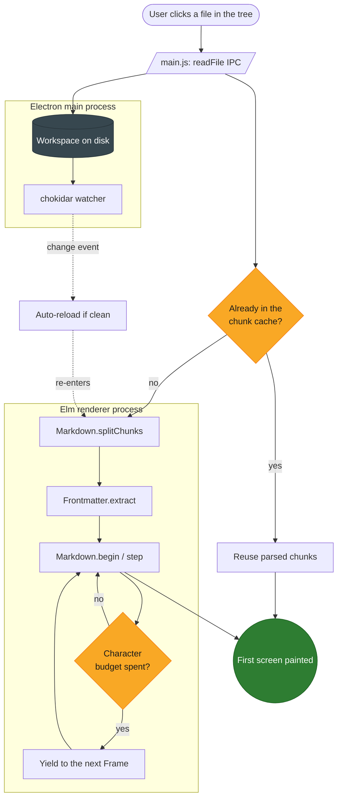

## Flowchart (flowchart LR)

The same app seen as a release pipeline, laid out left to right with the newer
`flowchart` keyword, multi-hop edges and a link style override.

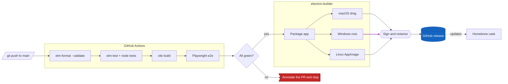

## Sequence diagram

Saving a dirty buffer, including the watcher echo that Fence has to ignore.
Covers participants, activations, a loop, `alt`/`opt` blocks and notes.

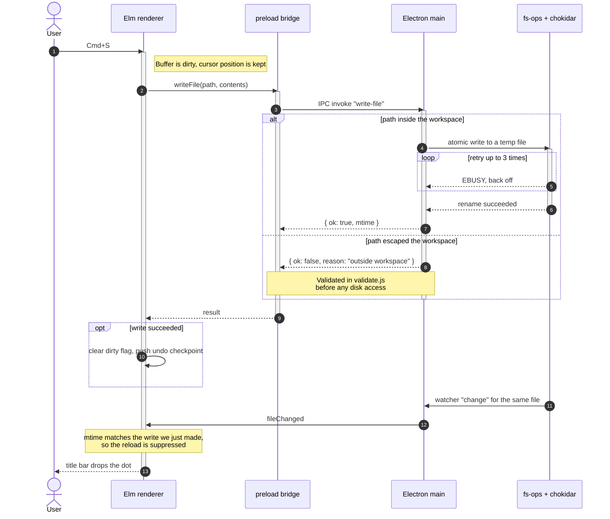

## Class diagram

The renderer side of the editor as types. Covers inheritance, composition,
aggregation, generics, visibility markers, abstract members and cardinalities.

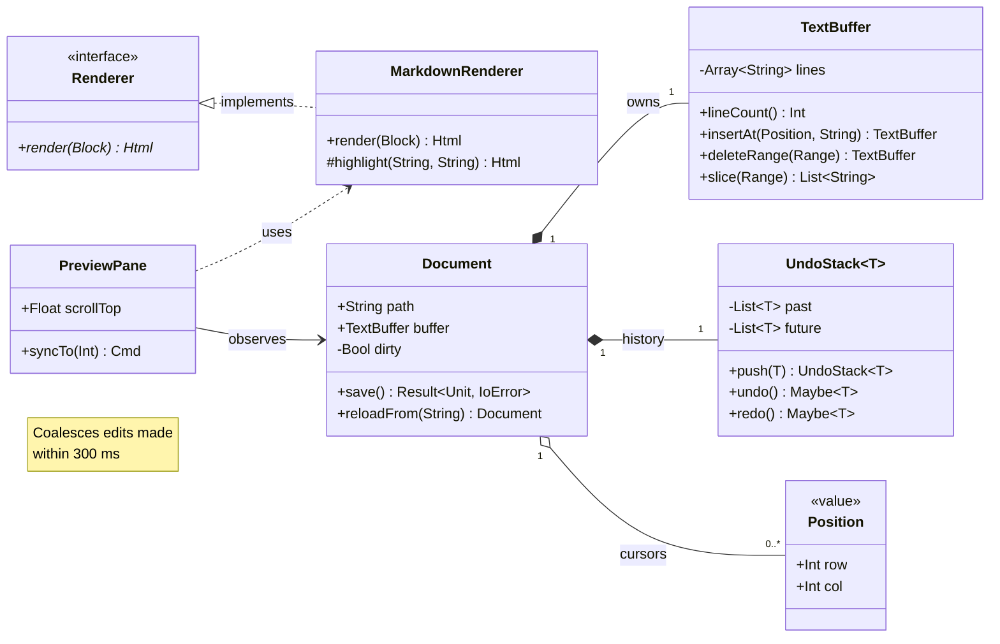

## State diagram

The lifecycle of an open document, with composite states, a fork/join for the
two parses that run side by side, and a choice node for the close prompt.

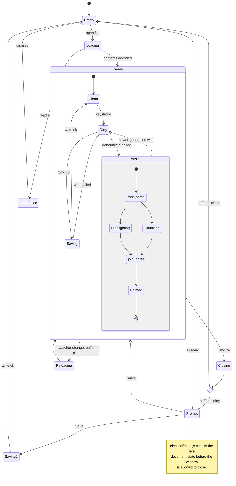

## Entity relationship diagram

The workspace index a file-search feature would persist, with primary, foreign
and unique keys, comments and explicit cardinalities.

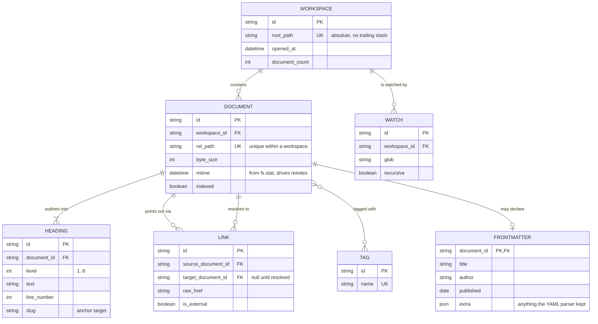

## Gantt chart

A plausible schedule for shipping a plugin system, with sections, explicit
dependencies, milestones, an active task and a done task.

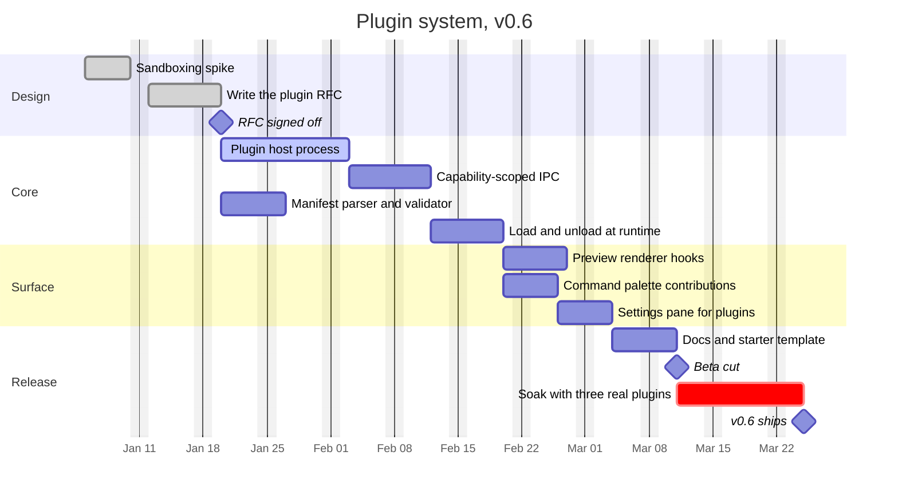

## Pie chart

Where startup time goes on a cold open of a 700 KB reference document.

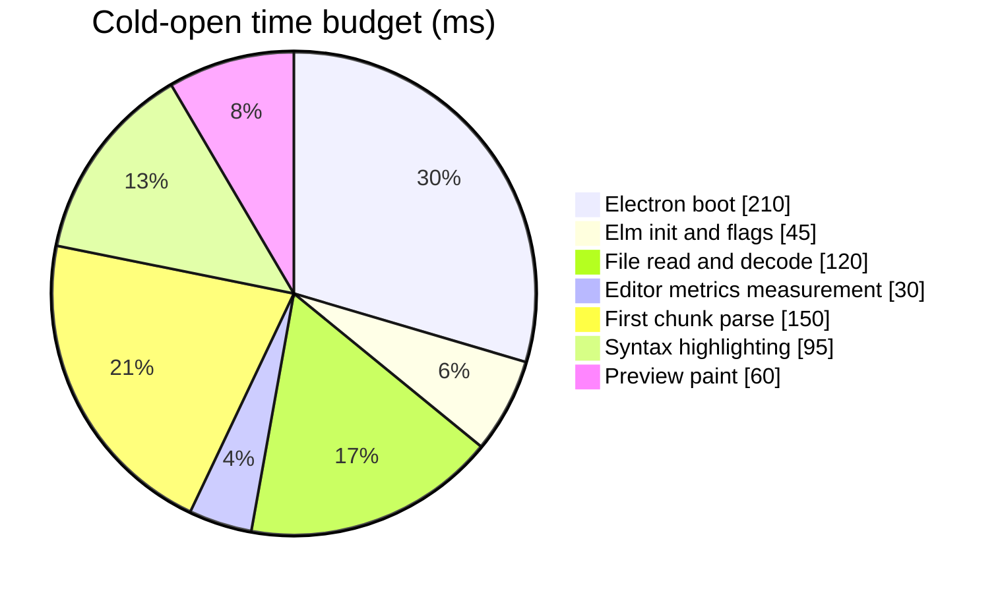

## User journey

A first session with the app, scored from 1 (painful) to 5 (delightful).

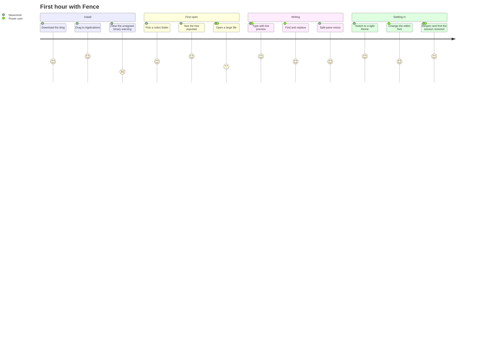

## Git graph

How a release branch is cut, patched and merged back.

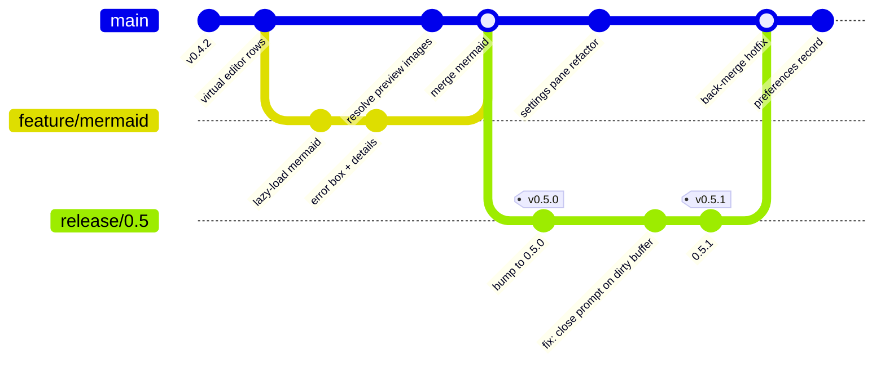

## Mindmap

The feature surface of the editor, as a map rather than a list. Uses the
shape variants (cloud, hexagon, rounded, bang) and an icon-free plain root.

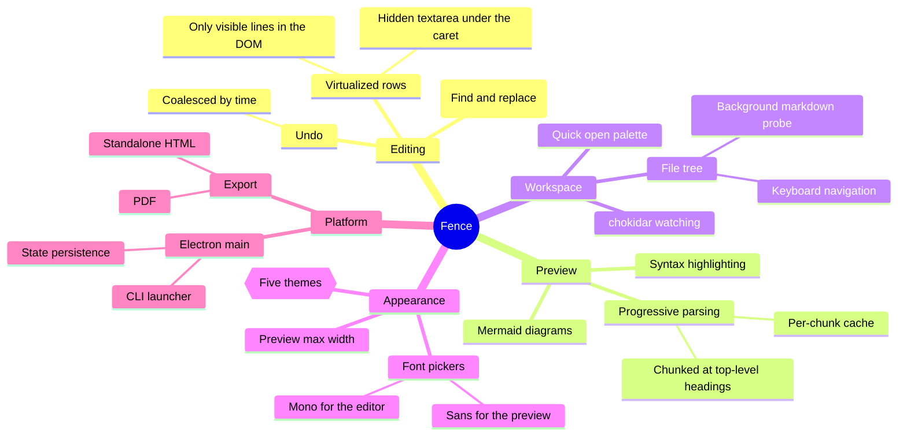

## Timeline

The project's own release history, grouped by period.

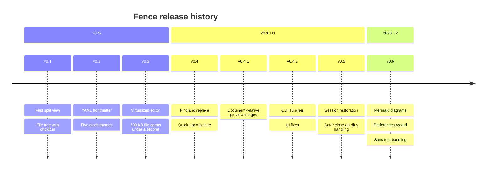

## Quadrant chart

Where the backlog sits on effort against user-visible payoff.

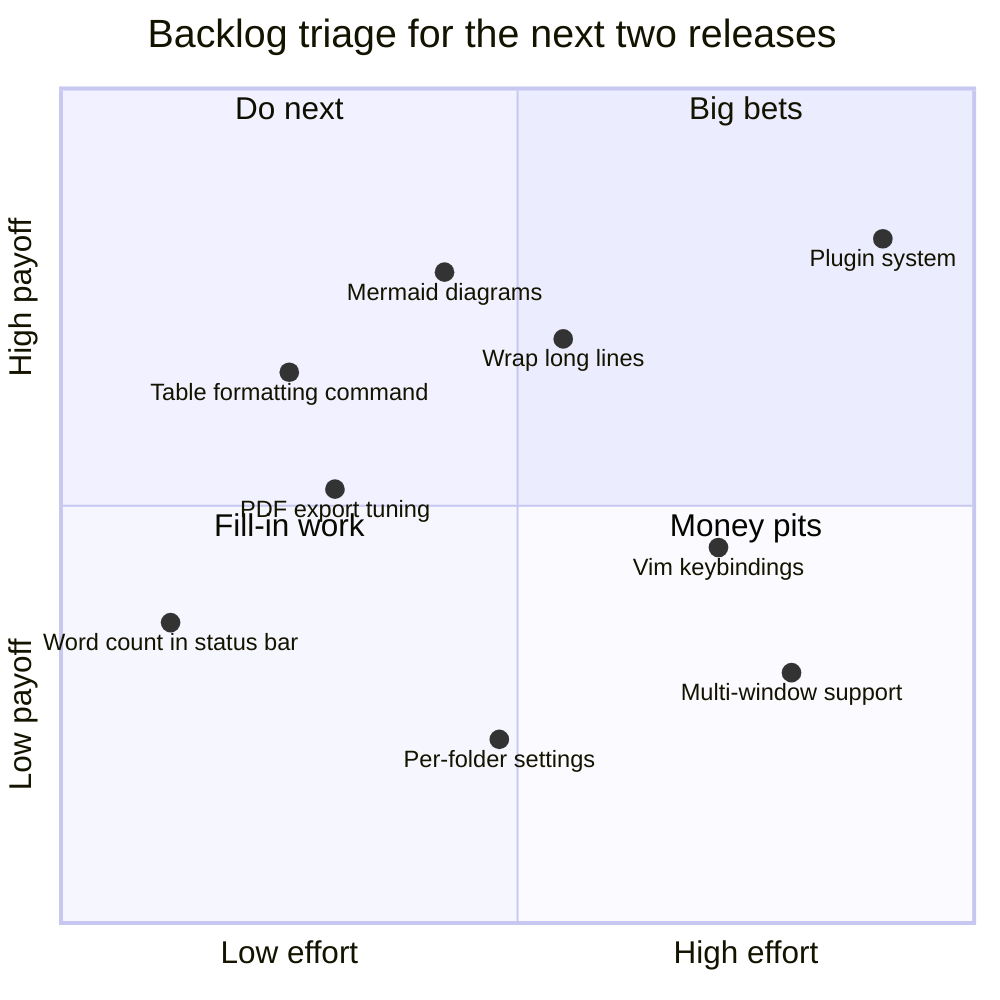

## Requirement diagram

Traceability for the editor's performance and safety requirements.

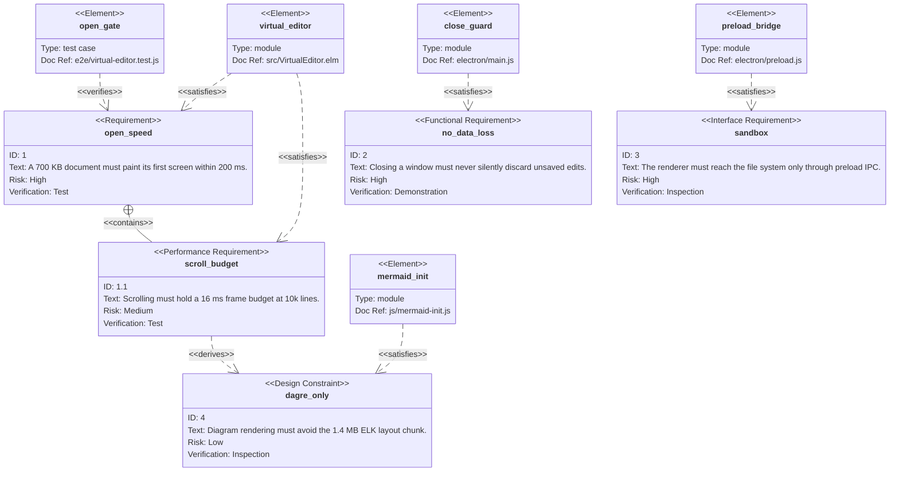

## C4 context diagram

The system context for the editor: who uses it and what it touches. C4 ships
its own renderer, so it is unaffected by the dagre layout setting.

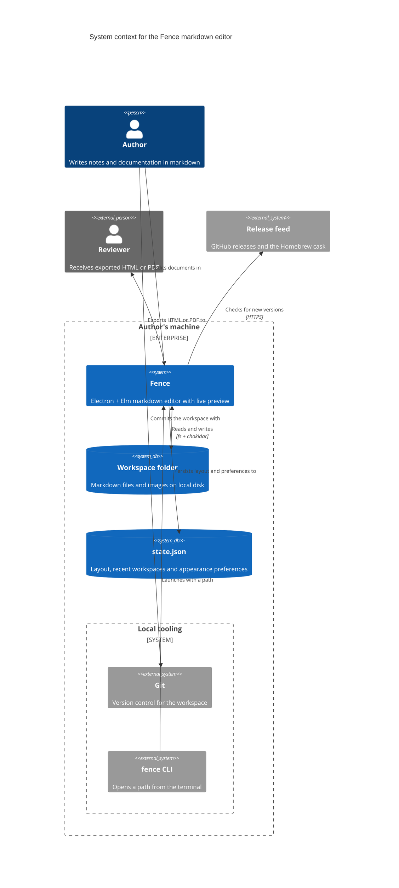

## Experimental / may not render

Mermaid still labels the diagram types below as beta: their keywords carry a
`-beta` suffix and their syntax has changed between minor releases. Treat a
failure here as expected rather than as a Fence regression, and only chase it
if one of them used to render and has stopped.

### XY chart (`xychart-beta`)

Parse time against document size, as a bar and line pair.

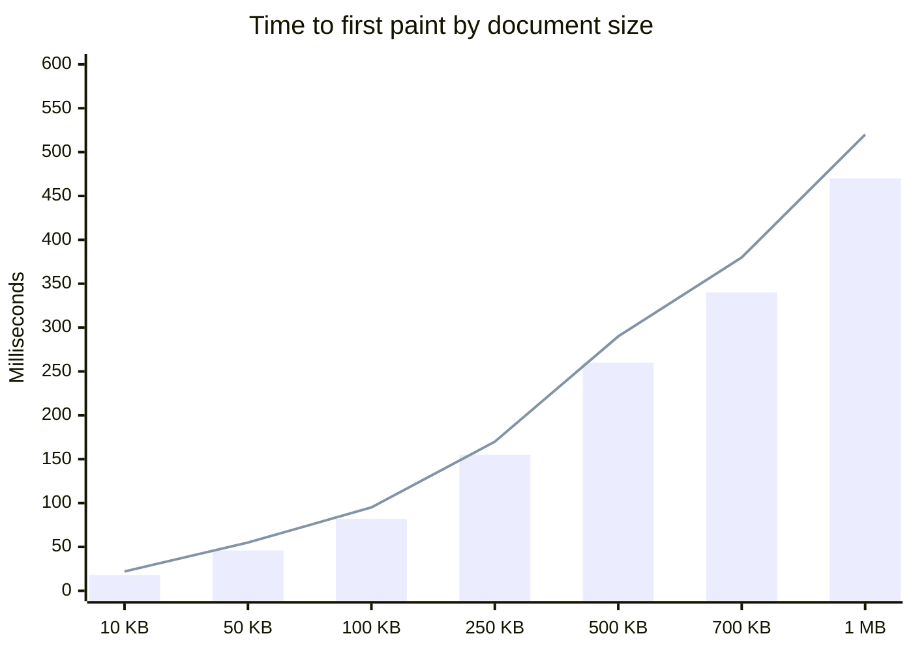

### Sankey (`sankey-beta`)

Where the bytes in a packaged build end up. Values are in kilobytes.

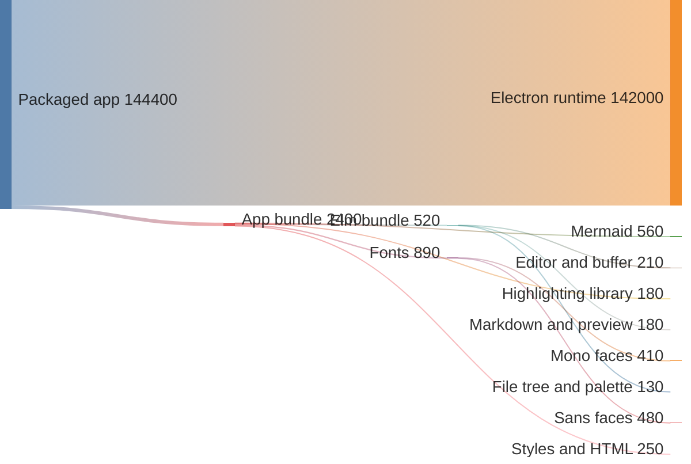

### Block diagram (`block-beta`)

The process boundary laid out as blocks rather than as a graph.

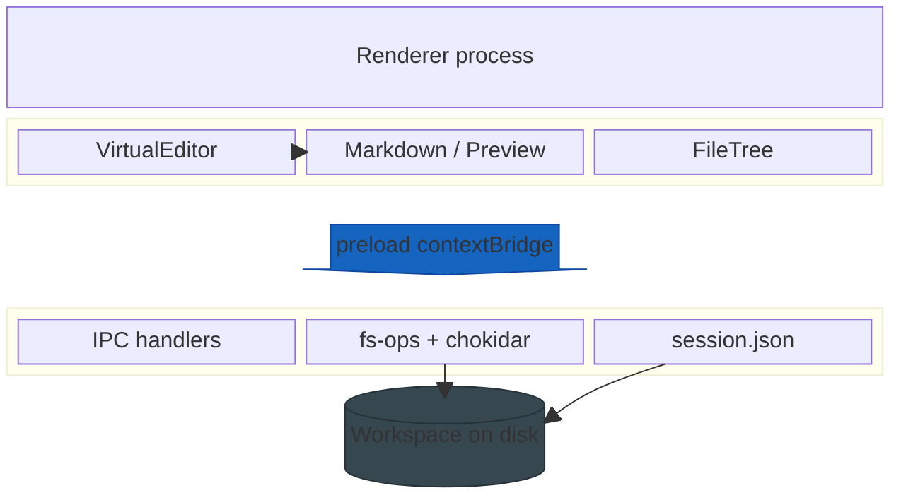

## Error handling

The block below is deliberately malformed: it declares a sequence diagram and
then uses flowchart edges with an unbalanced bracket. Fence should replace it
with a "Couldn't render diagram" box containing the parser message and a
collapsed `<details>` holding the source — and the rest of this page, including
every diagram above, must keep rendering normally.

```mermaid
sequenceDiagram
    participant A
    A --> B[[[ this is not sequence syntax
    ::: neither is this
    alt unclosed
```

If instead you see a blank gap, a raw SVG error graphic, or a page that stops
rendering at this point, that is a bug in `js/mermaid-init.js`.
